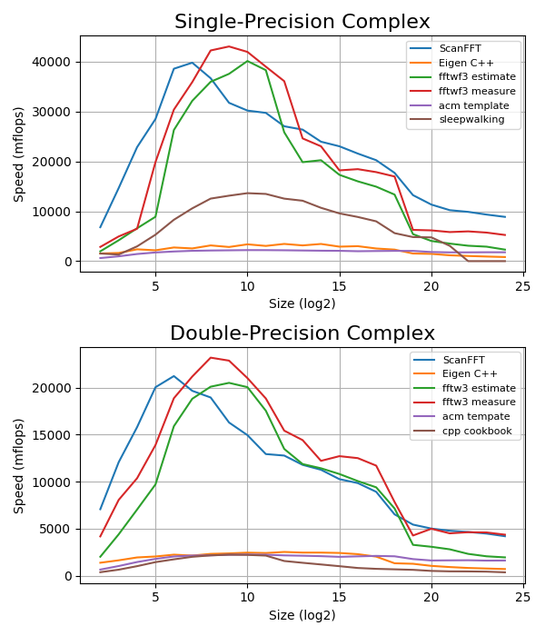

# 缘起
- 一直以来FFT大名如雷贯耳，但总觉得是高级算法，不知道原来他跟快排等一样很容易手写
- 这次终于下决心要实现FFT，一是因为刚在高数和线代里面看到傅里叶变换，然后，有段时间没写代码了，想练练手，实现FFT是个好机会。至于应用嘛，我两年前写过大数乘法，只会用naive的小学乘法，逐位相乘错位相加，结果性能悲剧了，怎么优化编码、内存分配都没卵用... 后来知道大数乘法里面花样多，各种算法，包括FFT，故重拾大数乘法实现，用FFT加速
# 原理
## FFTW
- 对于有心研究FFT的高性能实现的人来说，FFTW是座绕过不去山，基本上一搜高性能实现、programming tricks，都会指向FFTW （Fastest Fourier Transform in the West）。这个库主要是90年代由MIT的应用数学博士写成的，里面涉及PLT、编译器、体系结构，以及傅里叶变换相关的数学、算法知识，FFTW的快，是组合这各种知识的成果，他的厉害，以至我大概看过的他的实现文档和论文过后，就明白，别看FFT可以实现得极其简单，但谈及高效实现，有FFTW珠玉在前，短时间真的很难望其项背
- 我大致看过这两篇中我感兴趣的部分（即一般的FFT实现技巧）：[Implementing FFTs in Practice](http://cnx.org/contents/ulXtQbN7@15/Implementing-FFTs-in-Practice) ，[A Fast Fourier Transform Compiler](http://www.fftw.org/pldi99.pdf) ，我没有看，但对了解具体的FFTW这个库的实现比较必要的是 [The Design and Implementation of FFTW3](http://www.fftw.org/fftw-paper-ieee.pdf)
## 实现要点：
- 各种FFT算法
  - 首先FFT的各种算法，大O都是nlogn，这里讨论的性能，主要是常系数，具体来说是操作数多寡。
  - 算法层面，算法导论和一些线代经典著作讲的是 Radix 2 的 Cooley–Tukey FFT 算法，但另外还有更多选择，包括Radix 4以及更高基，基越大越高效；Split Radix 算法以及改进版本，被证明总操作数最少；另外一些算法可能侧重乘法最少（在今天的计算机上通过增加加减法来减少乘法，已经没有意义）
  - 另外当采用bit-reverse copy的迭代FFT实现时，具体采用时分或频分，对于特定的上层应用如卷积，可能可以省略bit-reverse copy，后者对cache比较敏感
  - FFT算法的不同影响的另一个因素是输入的size，像Radix 2的Cooley-Tukey只能对size=2^n的复数数组做DFT，而Split Radix主要是对4^n的数组做变换，其他算法还有针对素数size做变换的，不过由于不同算法可以组合，所以如果实现了多种算法，那size的限制就比较小，否则可能需要用户对输入做padding
- 输入尺寸较小时
  - 由于FFT实际上是用傅里叶变换矩阵乘以输入的复数数组，对特定size的输入来说，不管输入的值是什么，这个矩阵都是固定的，换句话说，DFT=Mul(FourierMatrix, InputVec)，这里的FourierMatrix仅取决于InputVec.Size。在程序优化方面，这种场景的典型优化手段，是预处理，或者说Partial Evaluation，即不把DFT看做是算法Mul加上两个参数FourierMatrix、InputVec，而是看做F=Mul(FourierMatrix, PlaceHolder)，DFT=F(InputVec)，即先将Mul和参数FourierMatrix结合生成新算法F，这个F仅取决于size，然后对相同size的不同InputVec，都应用这个新算法F。换句话说，FFT= FList.Lookup[ InputVec.Size ].Apply (InputVec) ，这种策略，是小size的FFT主要优化手段
  - 如果对任意size都生成专门的F，则需要库具有JIT能力，且单个函数F的优化程度受运行时开销制约；反过来，如果将支持的size限制到一个有限的集合，比如只支持2^n的size，对其他size用户自己去做padding，那么对一般的应用，比如size小于1M的场合来说，需要生成的专门的函数个数不过20个，于是全部可以离线生成，保证高质量的优化。
  - 所谓小size场合下对Mul(FourierMatrix, PlaceHolder)做预处理，也就是将这个矩阵乘法完全展开，当size为n时，需要n^2个复数乘法，n*(n-1)次加法，那基本的处理，在生成的函数中直接hard code输入元素 (例如Input[5]) 乘以傅里叶矩阵的常复数再做加法等，这样相比普通的矩阵/向量乘法，至少省掉了循环、部分间接寻址的开销；但对FFT来说，这种unrolling的优化只是小头，更关键的是，这个矩阵，不止是一个常数矩阵，更是具有各种对称性质的傅里叶矩阵，怎样利用他的对称性将乘法加法减少到n^2以下呢？做常规的程序优化去找公共表达式去冗余？答案是，直接利用Cooley-Tukey等FFT算法来做代码生成，因为他们本身就在不同程度上利用了离散傅里叶矩阵的对称性，所以在生成特定size的FFT的时候，直接跑Radix 2等FFT算法来做code gen，依照这些算法本身的计算过程，生成的操作数，就不再是普通矩阵/向量乘法的n^2，而是nlogn个操作（直接的体现是，code gen出来的函数变短了）
  - 在code gen生成某个size的FFT特化版本时，一个需要考虑的因素是，对输入做各种乘法和加法，显然会有很多中间结果（临时变量），而计算出这些临时变量到下次使用的间隔，决定了这个变量应该放到寄存器还是暂存到栈上，换句话说，code gen的计算顺序，会影响register spilling。之所以做code gen的时候需要考虑寄存器溢出问题，而不是简单的将他扔给编译器（如果你不是直接生成汇编/机器码，而是code gen出c代码再编译的话），是因为，哪怕是size=64的FFT，最终的乘法数都会有64*log2(64)=384这个级别，单个函数hard code这个级别的乘法（以及相应的临时变量），对编译优化来说是个很大的压力，很可能得到较差的结果（后来我产生了单个函数2000+以上的操作），因此由我们拥有FFT这个领域知识的code generator来适当组织code gen顺序，是有助于减少寄存器溢出的。这一点，FFTW的论文 [A Fast Fourier Transform Compiler](http://www.fftw.org/pldi99.pdf) 有证明，简单的采用递归版本的Cooley-Tukey算法来做、生成代码，寄存器溢出会逼近下界，这其实是一个cache-oblivious 问题
  - 做code gen时，由于当前的离散傅里叶矩阵其实是常数，所以要充分利用特殊单位复根的性质，比如和i、-i相乘，实部、虚部相等或相反等情况，充分利用这些情形能减少乘法。虽然这些特殊的复根只有有限几个，但是对大size做FFT时，递归得到的小size的FFT是很多的，故特殊复根的总个数是很多的，因此这里的强度消减优化很有效
  - 另一个问题生成的代码应该最大化CPU的数据级并行，比如采用最新的SIMD指令集。FFTW的做法是，分别对输入的实部和虚部做FFT，再对结果做组合；而我用到的方法是，根据离散傅里叶矩阵的对称性，在code gen过程中，如果当前数据并行的程度没到目标指令集的上限，则将输入拆分，并行计算
- 输入尺寸较大时
  - 这种尺寸显然不再能做unrolling了（你不可能将1M或更多个元素的矩阵向量乘法的中间结果全放栈上），得老老实实的调用各种FFT算法
  - 谈及大尺寸，第一个要考虑的是内存局部性，即怎样有效的减少各级cache miss。这也涉及cache-oblivious算法，FFTW在这里 [Implementing FFTs in Practice](http://cnx.org/contents/ulXtQbN7@15/Implementing-FFTs-in-Practice) 有讨论，比较意外的是，算法导论等经典推崇的breadth-first的迭代算法，反而比depth-first的递归算法更差，后者的cache miss数，可以用类似算法复杂度的计算方法讨论，被证明是逼近下界的。故，同小size为减少寄存器溢出而采用递归算法做code gen一样，大size为减少cache miss，也应该采用递归版本而不是迭代。一般来说，分治有更好的局部性
  - 关于这个尺寸上的数据级并行，由于各种FFT算法在当前层都是O(n)的，有一个循环，故也是天然并行的。相比之下，输入采用复数的数组（AOS）会比实部数组+虚部数组（SOA）更差，后者可以直接达到指令集最大数据并行度，而且复数乘法运算无需在向量寄存器间shuffle
  - 在小size的时候，傅里叶矩阵的所有常数，都是直接编码到unrolling过后的函数体中的，并利用特殊复根做强度消减；大size显然不能这么做，一般来说是做表，预计算用到的所有复根。对于size=2^20以下的所有2^n的FFT，用到的复根其实全是2^20的复根，换句话说，从去冗余的角度上说，只存储2^20的1M个复根即可，如果按complex double 来算，16M bytes的空间。但在实现上，为了更好的局部性，为每个size生成不同的复根表（尽管表间是冗余的），毕竟如果共享2^20的表的话，那么处理的2^10的FFT的时候，读取复根其实在访问表的不同位置，cache line的利用率很低；而且特定size的复根存储不连续的话，做数据级并行的时候没法一次读取多路复根
  - 大尺寸的情况下，bit-reverse copy操作的缓存局部性很差的问题会暴露出来。所谓bit-reverse copy，是指，把源数组的第i个元素，复制到目的数组的reversed(i)位置，这里reversed(i)是索引i的各bit顺序反向。显然，对于经典的实现，连续增加的i，是在低bit做自增，而reversed(i)会在最高位做递增，故，无论是dest[i]=src[reversed(i)]还是dest[reversed(i)]=src[i]，源或目的，总有一边的访存是离散的，局部性非常差。相对而言，reversed(i)放在dest那边，而让src得以顺序访问，并行性会略高，但即使如此，仍然会有严重的cache miss，在size较大时体现为store bound，甚至开销明显超过FFT本身的计算。后来我用到的算法，对bit-reverse copy的要求略有变化，要求i的最高8位直接右移到低位，而低的k-8位逆序后左移到最高位，这就给改善局部性提供了契机：连续的8个元素i+0 ~ i+7，他们是低3位变化高8位相同，故按照高8位直接右移、低k-8位逆序后左移的规则，这8个元素属于8个内存段的相同偏移（由高8位决定），那么copy完这8个元素后，不去copy相邻的下面8个元素，改去copy从i+2^(k-8)开始的8个元素，这样的8个元素，他们的目标位置，将属于同样的8个cache line，只是内部offset +1了，换句话说，两轮操作的16个元素，读方面访问了2个cache line （8个double是64字节，刚好一个cache line），写方面是访问了相同的8个输出cache line，并且每个cache line写了两个元素。这种特殊的访问模式，使得修改版的bit-reverse copy有很好的缓存局部性，cache miss数逼近下界，每个cache line利用率最大化。另外一个注意事项，即使用了这里提到的技巧，仍然可能得到大量的cache miss：由于reversed index都是高bit变换，低bit相同，他们在L1或L2上将可能被映射到相同的set，如果L1是8-way的，那么假设你每次读取16个float（刚好一个输入cache line），写出到16个输出cache line，由于这16个元素属于相同的set，而L1仅仅是8-way的，这会造成大量的cache line replacement，活活的引入大量miss，尤其是考虑你可能同时写实数组和虚数组，如果他们基地址对齐的话那更成问题，对策是减少一次读入的元素，或输出的cache line一次写完而不是一次写一个元素（比如用SIMD寄存器一次读入8组8 float，处理完过后写8次连续的8 float）
# 实现
## 精简实现
- 足够简单的[python实现](https://github.com/GHScan/DailyProjects/blob/master/Python/BigInteger/bigint.py#L9)，通过倍增输入，你能观察到以nlogn增长的耗时：
  ```python
  def fft(a, flag, N=1):
      if len(a) == 1: return [a[0]/(N if flag<0 else 1)]
      b1 = fft(a[0::2], flag, max(len(a), N))
      b2 = fft(a[1::2], flag, max(len(a), N))
      ws = [e**(2j*flag*i*pi/len(a)) for i in range(len(b1))]
      ts = list(zip(b1, b2, ws))
      return [c1+c2*w for (c1,c2,w) in ts] + [c1-c2*w for (c1,c2,w) in ts]
  ```
- 这是分治教科书，各种算法书分治章节的压轴，根据主定理能够很容易判断他是nlogn的
## 经典实现
- 一个[递归版的c++实现](https://github.com/GHScan/DailyProjects/blob/master/C%2B%2B/BigInteger2/BigInteger2/FFT.cpp#L16) ，除了语言本身的复利外，注意和python版的一个区别，通过递增步进来避免even-odd partition：
  ```c++
  static void RecursiveFFT(
      std::complex<Float> *dest, std::complex<Float> const *src,
      size_t size, size_t step,
      std::complex<Float> w, Float scale) {
      
      if (size == 1) {
          *dest = *src * scale;
      } else {
          auto halfSize = size / 2;
          auto w2 = w * w;

          RecursiveFFT(dest, src, halfSize, step * 2, w2, scale);
          RecursiveFFT(dest + halfSize, src + step, halfSize, step * 2, w2, scale);

          auto wi = std::complex<Float>(1);
          for (size_t i = 0; i < halfSize; ++i) {
              auto c0 = dest[i], c1 = dest[i + halfSize];
              auto wc1 = wi * c1;
              dest[i] = c0 + wc1;
              dest[i + halfSize] = c0 - wc1;
              wi *= w;
          }
      }
  }
  ```
- 算法导论里推崇的通过bit-reverse copy来替代even-odd partition，进而做[迭代](https://github.com/GHScan/DailyProjects/blob/master/C%2B%2B/BigInteger2/BigInteger2/FFT.cpp#L68)：
  ```c++
  static void FFT(
      std::complex<Float> *dest, std::complex<Float> const *src,
      size_t size,
      std::complex<Float> w, Float scale) {
      
      std::vector<std::complex<Float>> ws(size / 2);
      auto wi = std::complex<Float>(1);
      for (auto &v : ws) {
          v = wi;
          wi *= w;
      }

      if (scale == 1) {
          for (size_t i = 0, bc = static_cast<size_t>(log2(size)); i < size; ++i)
              dest[ReverseBits(i, bc)] = src[i];
      } else {
          for (size_t i = 0, bc = static_cast<size_t>(log2(size)); i < size; ++i)
              dest[ReverseBits(i, bc)] = src[i] * scale;
      }

      for (size_t s = 2; s <= size; s <<= 1) {
          size_t halfS = s / 2;
          size_t dw = size / s;
          for (size_t i = 0; i < size; i += s) {
              for (size_t j = 0, iw = 0; j < halfS; ++j, iw += dw) {
                  auto c0 = dest[i + j], c1 = dest[i + j + halfS];
                  auto wc1 = ws[iw] * c1;
                  dest[i + j] = c0 + wc1;
                  dest[i + j + halfS] = c0 - wc1;
              }
          }
      }
  }
  ```
- 好了，一个问题，i的按位逆序怎么求？（注意，i的有效位数k等于log2(size) ）两步：
    - 把i看作32位来逆序 （比2^32更大的数组的傅里叶变换不是双精度浮点误差能容忍的）
    - 右移(32-k)位
- 至于逆序32位，很常见的版本：
    ```c++
    unsigned int reverse(register unsigned int x)
    {
        x = (((x & 0xaaaaaaaa) >> 1) | ((x & 0x55555555) << 1));
        x = (((x & 0xcccccccc) >> 2) | ((x & 0x33333333) << 2));
        x = (((x & 0xf0f0f0f0) >> 4) | ((x & 0x0f0f0f0f) << 4));
        x = (((x & 0xff00ff00) >> 8) | ((x & 0x00ff00ff) << 8));
        return((x >> 16) | (x << 16));
    }
    ```
- 缺点是比较慢，更快的版本是：
    ```c++
    inline size_t ReverseBits(size_t i, size_t bitCount) {
        ASSERT(bitCount <= 32);
        auto rev = (Reverse8Bits((i >> 0) & 0xff) << 24)
            | (Reverse8Bits((i >> 8) & 0xff) << 16)
            | (Reverse8Bits((i >> 16) & 0xff) << 8)
            | (Reverse8Bits((i >> 24) & 0xff) << 0);
        return rev >> (32 - bitCount);
    }
    ```
- 在这里讨论怎么写ReverseBits不是讨论茴字的几种写法，而是bit-reverse copy真的会有成为瓶颈的一天

- 稍微profile一下上面的代码，你会发现热点在上面的butterfly操作，理所当然的用SSE重写：
  ```c++
  #if (USE_SIMD && !USE_SINGLE_FLOAT_FFT)
      Butterfly_SSE(
          reinterpret_cast<double*>(dest + i + j),
          reinterpret_cast<double*>(dest + i + j + halfS),
          reinterpret_cast<double*>(&ws[iw]));
  #else
      auto c0 = dest[i + j], c1 = dest[i + j + halfS];
      auto wc1 = ws[iw] * c1;
      dest[i + j] = c0 + wc1;
      dest[i + j + halfS] = c0 - wc1;
  #endif
  ...
  #if USE_SIMD
  static void Butterfly_SSE(double *dest0, double *dest1, double *w) {
      auto r1 = _mm_loaddup_pd(dest1);
      auto i1 = _mm_loaddup_pd(dest1 + 1);
      auto cw = _mm_load_pd(w);
      auto revcw = _mm_shuffle_pd(cw, cw, 1);

      auto t0 = _mm_mul_pd(r1, cw);
      auto t1 = _mm_mul_pd(i1, revcw);

      auto wc1 = _mm_addsub_pd(t0, t1);

      auto c0 = _mm_load_pd(dest0);

      auto nc0 = _mm_add_pd(c0, wc1);
      auto nc1 = _mm_sub_pd(c0, wc1);

      _mm_store_pd(dest0, nc0);
      _mm_store_pd(dest1, nc1);
  }
  #endif 
  ```
- 到这里，常规优化就结束了，profiler会告诉你butterfly还是热点，但似乎不太有办法进一步改善。这个版本由于引入SSE，会比常见的基本c++实现明显快，2000~5000 mflops 左右 （我的 E3-1231 v3 CPU上）
# 优化
- 上面讲了常规优化，现在进入FFT专门优化篇章，把代码从从几十行改到2000+行以及数万行生成的代码，当然不是只为了增加code size。为此我专门做了个库，在[这里](https://github.com/GHScan/DailyProjects/tree/master/C%2B%2B/ScanFFT) 。值得一提的是，虽然这个库在某些指标上接近甚至超过FFTW，但优化的水平其实不可同日而语。按照开篇实现要点的顺序，我这里也分开讲，小尺寸的处理，大尺寸的处理，以及bit-reverse copy的实现

## 小尺寸的处理
- [Unrolled FFT code generator](https://github.com/GHScan/DailyProjects/blob/master/C%2B%2B/ScanFFT/ScanFFT_UnrolledFFTGen/UnrolledFFTGen.fs) ，用F#写的
  - 总的来说它定义了个静态类型的基于[浮点向量](https://github.com/GHScan/DailyProjects/blob/master/C%2B%2B/ScanFFT/ScanFFT_UnrolledFFTGen/UnrolledFFTGen.fs#L12)的DSL，由于直接在内存里做从的code gen，故这个DSL没有源码形式，全程操作带[类型标记的AST](https://github.com/GHScan/DailyProjects/blob/master/C%2B%2B/ScanFFT/ScanFFT_UnrolledFFTGen/UnrolledFFTGen.fs#L15) 
  - 它的主要功能是按Radix-2 Cooley-Tukey算法的执行顺序来做[代码生成](https://github.com/GHScan/DailyProjects/blob/master/C%2B%2B/ScanFFT/ScanFFT_UnrolledFFTGen/UnrolledFFTGen.fs#L298)，从而保证生成的操作指令是nlogn的（也试过Radix-4 FFT和Split-Radix做代码生成，结合这个code generator本身的能力过后，执行效率略差）
  - 根据指定的并行级别参数，他会在运行Radix-2 FFT的过程中尝试[提高并行度](https://github.com/GHScan/DailyProjects/blob/master/C%2B%2B/ScanFFT/ScanFFT_UnrolledFFTGen/UnrolledFFTGen.fs#L313)（这里基本和运行时对应，每提高一次，执行效率几乎翻倍，上限取决于CPU指令集）。根据用户指定的并行度参数，可以生成纯C++、SSE或AVX的目标码
  - 它会利用特殊的复根，如1、-1、i、-i，以及实部虚部相等的情况进行[强度消减](https://github.com/GHScan/DailyProjects/blob/master/C%2B%2B/ScanFFT/ScanFFT_UnrolledFFTGen/UnrolledFFTGen.fs#L224)
  - 常规的[冗余消除](https://github.com/GHScan/DailyProjects/blob/master/C%2B%2B/ScanFFT/ScanFFT_UnrolledFFTGen/UnrolledFFTGen.fs#L114)和[死代码删除](https://github.com/GHScan/DailyProjects/blob/master/C%2B%2B/ScanFFT/ScanFFT_UnrolledFFTGen/UnrolledFFTGen.fs#L43)，通过严格限制DSL的能力我们可以简化所有这些操作
  - 最后它可以生成[单精度/双精度的C++代码](https://github.com/GHScan/DailyProjects/blob/master/C%2B%2B/ScanFFT/ScanFFT_UnrolledFFTGen/UnrolledFFTGen.fs#L350)，或[单精度](https://github.com/GHScan/DailyProjects/blob/master/C%2B%2B/ScanFFT/ScanFFT_UnrolledFFTGen/UnrolledFFTGen.fs#L499)/[双精度](https://github.com/GHScan/DailyProjects/blob/master/C%2B%2B/ScanFFT/ScanFFT_UnrolledFFTGen/UnrolledFFTGen.fs#L422)的SIMD码。根据用户配置的并行度，SIMD版的translator可以生成SSE或者AVX指令集，如果将来AVX512成熟了大概添加20、30行代码就能支持更高一倍的并行度
  - 这个小尺寸FFT generator的SIMD版输出长这样：
    ```c++
        void FFT_2(float *destReals, float *destImags, float const *srcReals, float const *srcImags) {
            auto temp_0=_mm_loadl_pi(_mm_setzero_ps(), reinterpret_cast<__m64 const*>(&srcReals[0]));
            auto temp_1=_mm_loadl_pi(_mm_setzero_ps(), reinterpret_cast<__m64 const*>(&srcImags[0]));
            auto temp_2=_mm_loadl_pi(_mm_setzero_ps(), reinterpret_cast<__m64 const*>(&srcReals[2]));
            auto temp_3=_mm_loadl_pi(_mm_setzero_ps(), reinterpret_cast<__m64 const*>(&srcImags[2]));
            auto temp_4=_mm_add_ps(temp_0, temp_2);
            auto temp_5=_mm_add_ps(temp_1, temp_3);
            auto temp_6=_mm_sub_ps(temp_0, temp_2);
            auto temp_7=_mm_sub_ps(temp_1, temp_3);
            auto temp_8=_mm_permute_ps(_mm_unpacklo_ps(temp_4, temp_6), 0xe);
            auto temp_9=_mm_permute_ps(_mm_unpacklo_ps(temp_5, temp_7), 0xe);
            auto temp_10=_mm_set_ps(0, 0, 0.00000000000000006123f, 1.00000000000000000000f);
            auto temp_11=_mm_set_ps(0, 0, 1.00000000000000000000f, 0.00000000000000000000f);
            auto temp_12=_mm_mul_ps(temp_8, temp_10);
            auto temp_13=_mm_mul_ps(temp_8, temp_11);
            auto temp_14=_mm_mul_ps(temp_9, temp_10);
            auto temp_15=_mm_mul_ps(temp_9, temp_11);
            auto temp_16=_mm_sub_ps(temp_12, temp_15);
            auto temp_17=_mm_add_ps(temp_13, temp_14);
            auto temp_18=_mm_unpacklo_ps(temp_4, temp_6);
            auto temp_19=_mm_unpacklo_ps(temp_5, temp_7);
            auto temp_20=_mm_add_ps(temp_16, temp_18);
            auto temp_21=_mm_add_ps(temp_17, temp_19);
            auto temp_22=_mm_sub_ps(temp_18, temp_16);
            auto temp_23=_mm_sub_ps(temp_19, temp_17);
            _mm_storel_pi(reinterpret_cast<__m64*>(&destReals[0]), temp_20);
            _mm_storel_pi(reinterpret_cast<__m64*>(&destImags[0]), temp_21);
            _mm_storel_pi(reinterpret_cast<__m64*>(&destReals[2]), temp_22);
            _mm_storel_pi(reinterpret_cast<__m64*>(&destImags[2]), temp_23);
        }
    ```
  - 上面并行度2，在指定并行度8的情况下，size略增加，并行度会进一步提升到4和8： 
    ```c++
    void FFT_3(float *destReals, float *destImags, float const *srcReals, float const *srcImags) {
        auto temp_0=_mm_load_ps(&srcReals[0]);
        auto temp_1=_mm_load_ps(&srcImags[0]);
        auto temp_2=_mm_load_ps(&srcReals[4]);
        auto temp_3=_mm_load_ps(&srcImags[4]);
        auto temp_4=_mm_add_ps(temp_0, temp_2);
        auto temp_5=_mm_add_ps(temp_1, temp_3);
        auto temp_6=_mm_sub_ps(temp_0, temp_2);
        auto temp_7=_mm_sub_ps(temp_1, temp_3);
        auto temp_8=_mm_shuffle_ps(temp_4, temp_6, 0xee);
        auto temp_9=_mm_shuffle_ps(temp_5, temp_7, 0xee);
        auto temp_10=_mm_set_ps(0.00000000000000006123f, 0.00000000000000006123f, 1.00000000000000000000f, 1.00000000000000000000f);
        auto temp_11=_mm_set_ps(1.00000000000000000000f, 1.00000000000000000000f, 0.00000000000000000000f, 0.00000000000000000000f);
        ...
    }

    void FFT_4(float *destReals, float *destImags, float const *srcReals, float const *srcImags) {
        auto temp_0=_mm256_load_ps(&srcReals[0]);
        auto temp_1=_mm256_load_ps(&srcImags[0]);
        auto temp_2=_mm256_load_ps(&srcReals[8]);
        auto temp_3=_mm256_load_ps(&srcImags[8]);
        auto temp_4=_mm256_add_ps(temp_0, temp_2);
        auto temp_5=_mm256_add_ps(temp_1, temp_3);
        auto temp_6=_mm256_sub_ps(temp_0, temp_2);
        auto temp_7=_mm256_sub_ps(temp_1, temp_3);
        auto temp_8=_mm256_permute2f128_ps(temp_4, temp_6, 0x31);
        auto temp_9=_mm256_permute2f128_ps(temp_5, temp_7, 0x31);
        auto temp_10=_mm256_set_ps(0.00000000000000006123f, 0.00000000000000006123f, 0.00000000000000006123f, 0.00000000000000006123f, 1.00000000000000000000f, 1.00000000000000000000f, 1.00000000000000000000f, 1.00000000000000000000f);
        auto temp_11=_mm256_set_ps(1.00000000000000000000f, 1.00000000000000000000f, 1.00000000000000000000f, 1.00000000000000000000f, 0.00000000000000000000f, 0.00000000000000000000f, 0.00000000000000000000f, 0.00000000000000000000f);
        ...
    }
    ```
  - 这些输出就是综合了FFT算法自身的分治复杂度和generator本身的一些优化的效果。这里generate出来的最大的是size=256的函数，操作数是1359个。这个上限的选择，是测得的，再大，code size、寄存器分配等问题会导致时间不可接受。而大部分时间里，这些小尺寸FFT函数的表现不比FFTW差
## 大尺寸的FFT算法
- 这个尺寸下首先是做bit-reverse copy（最后讲），然后是in-place的做PostTransform，后者对应经典Cooley-Tukey FFT最后的逐层迭代butterfly，只是为了缓存局部性改用递归。他主要应对三种情形：
   - size=256，调用InplaceFFT_8，这是上面的FFT generator生成的in-place版本，在这个尺寸上，无疑是code gen出来的效果最好。这个case主要负责更大size分治下来的小问题
   - size=512，用来在InplaceFFT_8和Split Radix算法间做适配，因为后者要求将输入给partition掉，而前者要求保持顺序
   - 其他size，利用Split-Radix 分治将问题派发到更小规模，然后本层butterfly。其实这里的Split-Radix不是我最好的选择，现在的FFT generator已经是第4版了，只负责小size，而[第3版](https://github.com/GHScan/DailyProjects/blob/master/F%23/FFTCompiler/ProgramV3.fs)的时候generator也负责大size，它在大size上做的是类似Radix-8的分治，至少在当时表现很好，从小size方案到大size得到了较平滑的过渡。（这里没在沿用第3版的方案仅仅是个人精力问题，当前版本的Split-Radix是手工写的，为省事，但按之前经验，表现不如generator生成的高Radix版本）
- size=512用的是Radix-2的算法，相对比较简单：
    ```c++
    case SCANFFT_UNROLLED_LOG2_OF_SIZE + 1:
    {
        // Radix 2 FFT
        auto size = 1ULL << log2OfSize;
        auto halfSize = size >> 1;

        PostTransform(destReals, destImags, log2OfSize - 1);
        PostTransform(destReals + halfSize, destImags + halfSize, log2OfSize - 1);

        auto factorReals = &gFactorReal2DArray[log2OfSize][0], factorImags = &gFactorImag2DArray[log2OfSize][0];
        for (size_t i = 0; i < halfSize; i += SCANFFT_COMPLEXV_DIMENSION) {
            SCANFFT_COMPLEXV_LOAD(c1, dest, halfSize + i);
            SCANFFT_COMPLEXV_LOAD(wi, factor, i);
            SCANFFT_COMPLEXV_MUL(c1TimesWi, c1, wi);

            SCANFFT_COMPLEXV_LOAD(c0, dest, i);

            SCANFFT_COMPLEXV_ADD(x0, c0, c1TimesWi);
            SCANFFT_COMPLEXV_STORE(dest, i, x0);

            SCANFFT_COMPLEXV_SUB(x1, c0, c1TimesWi);
            SCANFFT_COMPLEXV_STORE(dest, halfSize + i, x1);
        }

        break;
    }
    ```
- 正如前面提到的，预计算的复根值(gFactorReal2DArray)为不同的size计算了冗余项，这个冗余使得不同size访问复根时是连续访存的，从而有更好的局部性，以及能做数据并行。有一个问题是需要考虑的，大size的情况下，预计算的表空间，会否导致更多的cache miss甚至不如就地求复根？就我的观察来说，大size下的确读表开销很大，但还是比复数乘法略小。
- 循环本身是一组复数操作宏，每个操作是同时对多组复数求butterfly：
    ```c++
    #define SCANFFT_COMPLEXV_DIMENSION 4
    #define SCANFFT_COMPLEXV_ASSIGN(name1, name0) name1##Real = name0##Real, name1##Imag = name0##Imag
    #define SCANFFT_COMPLEXV_MAKE1(name, real, imag) auto name##Real = _mm256_set1_pd(real), name##Imag = _mm256_set1_pd(imag)
    #define SCANFFT_COMPLEXV_LOAD(name, src, i) auto name##Real = _mm256_load_pd(src##Reals + i), name##Imag = _mm256_load_pd(src##Imags + i)
    #define SCANFFT_COMPLEXV_STORE(dest, i, name) _mm256_store_pd(dest##Reals + i, name##Real), _mm256_store_pd(dest##Imags + i, name##Imag)
    #define SCANFFT_COMPLEXV_ADD(name2, name0, name1) auto name2##Real = _mm256_add_pd(name0##Real, name1##Real), name2##Imag = _mm256_add_pd(name0##Imag, name1##Imag)
    #define SCANFFT_COMPLEXV_ADD_TIMES_I(name2, name0, name1) auto name2##Real = _mm256_sub_pd(name0##Real, name1##Imag), name2##Imag = _mm256_add_pd(name0##Imag, name1##Real)
    #define SCANFFT_COMPLEXV_ADD_TIMES_NEG_I(name2, name0, name1) auto name2##Real = _mm256_add_pd(name0##Real, name1##Imag), name2##Imag = _mm256_sub_pd(name0##Imag, name1##Real)
    #define SCANFFT_COMPLEXV_SUB(name2, name0, name1) auto name2##Real = _mm256_sub_pd(name0##Real, name1##Real), name2##Imag = _mm256_sub_pd(name0##Imag, name1##Imag)
    #define SCANFFT_COMPLEXV_SUB_TIMES_I(name2, name0, name1) SCANFFT_COMPLEXV_ADD_TIMES_NEG_I(name2, name0, name1)
    #define SCANFFT_COMPLEXV_SUB_TIMES_NEG_I(name2, name0, name1) SCANFFT_COMPLEXV_ADD_TIMES_I(name2, name0, name1)
    #define SCANFFT_COMPLEXV_MUL(name2, name0, name1) __m256d name2##Real, name2##Imag; do {\
        auto __realTimesReal = _mm256_mul_pd(name0##Real, name1##Real); \
        auto __realTimesImag = _mm256_mul_pd(name0##Real, name1##Imag); \
        auto __imagTimesReal = _mm256_mul_pd(name0##Imag, name1##Real); \
        auto __imagTimesImag = _mm256_mul_pd(name0##Imag, name1##Imag); \
        name2##Real = _mm256_sub_pd(__realTimesReal, __imagTimesImag); \
        name2##Imag = _mm256_add_pd(__realTimesImag, __imagTimesReal); \
    } while(0)
    ```
- 注意其中乘i、-i只是用宏来交换变量、交换加减(SCANFFT_COMPLEXV_ADD_TIMES_I, SCANFFT_COMPLEXV_ADD_TIMES_NEG_I)，并不用真的运算。在FFT gen v3的时候，这些都是generator作为强度消减的一部分自动完成
## Bit-Reverse Copy的优化
- 按理说，一个O(nlogn)的算法当中的O(n)部分，不值得特别关注，哪怕那个ReverseBits不够快，但怎可能成为瓶颈？事实是，他的确是瓶颈。如果说我的实现比FFTW在开始和末端略有优势，开始靠的是FFT gen生成的特化函数，那末端靠的可能就是bit-reverse copy的缓存友好性（因为PostTransform本身，大家最起码是cache-oblivious的递归实现）
- 好的，其实ReverseBits这个函数，的确耗时不菲的，尤其是在size明显小于cache时，但他还能怎样优化呢？记得我们有针对每个size生成特化的实现吗？这里也类似的code gen输出：(注意这里是ReverseBits的变种，即高8位直接右移，低k-8位逆序左移)
    ```c++
    // k=9
    // k=10
    // k=11
    auto revI0 = (i0 >> 3) | (Reverse8Bits(i0 & 0x7) << 3);
    // k=12
    auto revI0 = (i0 >> 4) | (Reverse8Bits(i0 & 0xf) << 4);
    // k=17
    auto revI0 = (i0 >> 9) | (Reverse8Bits(i0 & 0xff) << 9) | (Reverse8Bits((i0 >> 8) & 0x1) << 1);
    // k=24
    auto revI0 = (i0 >> 16) | (Reverse8Bits(i0 & 0xff) << 16) | (Reverse8Bits((i0 >> 8) & 0xff) << 8);
    ```
- k等于9和10的时候用有特殊算法直接避免了
- 好的，我们说瓶颈在于bit-reverse copy的源和目的，一方访存连续的时候，意味着i的低位在变化，那么reversed(i)就是高位变化，访存不连续，k较大的时候跨度也大，局部性很差。但是，我们又讨论过，由于这里用到的是ReverseBits的变种，是高8位直接右移，低k-8位逆序后左移，如果以访问i+0~i+7的8个元素后，再步进2^(k-8)，处理新的8个元素，那么这8个元素的目标位置会和前8个元素处在连续地址上，从而，读写都连续了。
- 具体来说，k=9和10的时候有特殊算法，k=11及以上每次处理8x8个元素，相当于转置:
    ```c++
    void BitReverseCopy_9(float *destReals, float *destImags, float const *srcReals, float const *srcImags) {
        for (size_t i = 0; i < 512; i += 16) {
            SplitEvenOdd_8PS(destReals, i / 2, i / 2 + 256, srcReals, i, i + 8);
            SplitEvenOdd_8PS(destImags, i / 2, i / 2 + 256, srcImags, i, i + 8);
        }
    }
    void BitReverseCopy_10(float *destReals, float *destImags, float const *srcReals, float const *srcImags) {
        for (size_t i = 0; i < 1024; i += 32) {
            SplitMod4_8PS(destReals, i / 4, i / 4 + 256, i / 4 + 512, i / 4 + 768, srcReals, i, i + 8, i + 16, i + 24);
            SplitMod4_8PS(destImags, i / 4, i / 4 + 256, i / 4 + 512, i / 4 + 768, srcImags, i, i + 8, i + 16, i + 24);
        }
    }
    void BitReverseCopy_11(float *destReals, float *destImags, float const *srcReals, float const *srcImags) {
        size_t span = 8;
        for (size_t off = 0; off < span; off += 8) {
            for (size_t i = off; i < 2048; i += 8 * span) {
                auto i0 = i + 0, i1 = i + 1, i2 = i + 2, i3 = i + 3, i4 = i + 4, i5 = i + 5, i6 = i + 6, i7 = i + 7;
                auto revI0 = (i0 >> 3) | (Reverse8Bits(i0 & 0x7) << 3);
                auto revI1 = (i1 >> 3) | (Reverse8Bits(i1 & 0x7) << 3);
                auto revI2 = (i2 >> 3) | (Reverse8Bits(i2 & 0x7) << 3);
                auto revI3 = (i3 >> 3) | (Reverse8Bits(i3 & 0x7) << 3);
                auto revI4 = (i4 >> 3) | (Reverse8Bits(i4 & 0x7) << 3);
                auto revI5 = (i5 >> 3) | (Reverse8Bits(i5 & 0x7) << 3);
                auto revI6 = (i6 >> 3) | (Reverse8Bits(i6 & 0x7) << 3);
                auto revI7 = (i7 >> 3) | (Reverse8Bits(i7 & 0x7) << 3);
                Transpose_8PS(
                    destReals, revI0, revI1, revI2, revI3, revI4, revI5, revI6, revI7,
                    srcReals, i, i + span, i + 2 * span, i + 3 * span, 
                              i + 4 * span, i + 5 * span, i + 6 * span, i + 7 * span);
                Transpose_8PS(
                    destImags, revI0, revI1, revI2, revI3, revI4, revI5, revI6, revI7,
                    srcImags, i, i + span, i + 2 * span, i + 3 * span,
                    i + 4 * span, i + 5 * span, i + 6 * span, i + 7 * span);
            }
        }
    }
    SCANFFT_FORCEINLINE static void SplitEvenOdd_8PS(
        float *destPtr, size_t d0, size_t d1, float const *srcPtr, size_t s0, size_t s1) {
        auto row0 = _mm256_load_ps(srcPtr + s0);
        auto row1 = _mm256_load_ps(srcPtr + s1);
        auto even = _mm256_permutevar8x32_ps(_mm256_shuffle_ps(row0, row1, 0x88), gF32Q2Q3SwapIdx);
        auto odd = _mm256_permutevar8x32_ps(_mm256_shuffle_ps(row0, row1, 0xdd), gF32Q2Q3SwapIdx);
        _mm256_store_ps(destPtr + d0, even);
        _mm256_store_ps(destPtr + d1, odd);
    }
    SCANFFT_FORCEINLINE static void SplitMod4_8PS(
        float *destPtr, size_t d0, size_t d1, size_t d2, size_t d3, 
        float const *srcPtr, size_t s0, size_t s1, size_t s2, size_t s3) {
        auto row0 = _mm256_load_ps(srcPtr + s0);
        auto row1 = _mm256_load_ps(srcPtr + s1);
        auto row2 = _mm256_load_ps(srcPtr + s2);
        auto row3 = _mm256_load_ps(srcPtr + s3);

        auto row01Lo = _mm256_unpacklo_ps(row0, row1);
        auto row01Hi = _mm256_unpackhi_ps(row0, row1);
        auto row23Lo = _mm256_unpacklo_ps(row2, row3);
        auto row23Hi = _mm256_unpackhi_ps(row2, row3);
        auto lololo = _mm256_unpacklo_ps(row01Lo, row23Lo);
        auto lolohi = _mm256_unpackhi_ps(row01Lo, row23Lo);
        auto hihilo = _mm256_unpacklo_ps(row01Hi, row23Hi);
        auto hihihi = _mm256_unpackhi_ps(row01Hi, row23Hi);
        row0 = _mm256_permutevar8x32_ps(lololo, gMod4PermIndex);
        row1 = _mm256_permutevar8x32_ps(hihilo, gMod4PermIndex);
        row2 = _mm256_permutevar8x32_ps(lolohi, gMod4PermIndex);
        row3 = _mm256_permutevar8x32_ps(hihihi, gMod4PermIndex);

        _mm256_store_ps(destPtr + d0, row0);
        _mm256_store_ps(destPtr + d1, row1);
        _mm256_store_ps(destPtr + d2, row2);
        _mm256_store_ps(destPtr + d3, row3);
    }
    SCANFFT_FORCEINLINE static void Transpose_8PS(
        float *destPtr, size_t d0, size_t d1, size_t d2, size_t d3, size_t d4, size_t d5, size_t d6, size_t d7,
        float const *srcPtr, size_t s0, size_t s1, size_t s2, size_t s3, size_t s4, size_t s5, size_t s6, size_t s7) {
        auto row0 = _mm256_load_ps(srcPtr + s0);
        auto row1 = _mm256_load_ps(srcPtr + s1);
        auto row2 = _mm256_load_ps(srcPtr + s2);
        auto row3 = _mm256_load_ps(srcPtr + s3);
        auto row4 = _mm256_load_ps(srcPtr + s4);
        auto row5 = _mm256_load_ps(srcPtr + s5);
        auto row6 = _mm256_load_ps(srcPtr + s6);
        auto row7 = _mm256_load_ps(srcPtr + s7);
        _MM256_TRANSPOSE8_PS(row0, row1, row2, row3, row4, row5, row6, row7);
        _mm256_store_ps(destPtr + d0, row0);
        _mm256_store_ps(destPtr + d1, row1);
        _mm256_store_ps(destPtr + d2, row2);
        _mm256_store_ps(destPtr + d3, row3);
        _mm256_store_ps(destPtr + d4, row4);
        _mm256_store_ps(destPtr + d5, row5);
        _mm256_store_ps(destPtr + d6, row6);
        _mm256_store_ps(destPtr + d7, row7);
    }
    ```
- 可以看到，由于大家的PostTransform都很高效，在bit-reverse copy上下功夫，分别特化了ReverseBits（小尺寸有效）、改进了访存局部性（大尺寸有效）、以及Transpose8这种高效读写cache line的方式过后（曾经某个size上用过Transpose 4，在吞吐曲线上观察到明显的不光滑，后来定位到可以进一步挖掘并行性，该函数从SSE换成AVX），我的实现在大尺寸上从比FFTW差一大截到略有优势

# 结语
- 关于FFT的这个故事，focus在算法复杂度的常系数上，和操作数、寄存器、cache交战，所以对编码要求提出了较高要求（和FFTW的算法差距也是有，主要体现在中间size上，FFTW有大量的算法组合），需要盯紧比如vtune这样的profile工具，对任何的奇异的性能惩罚保持敏感，对编译器和体系结构的理解有助于解决问题（这方面我是远远不够的，好几次很拙计，甚至有个4k aliasing至今没找到对策）
- 由于精力（在这个项目上投入2周，还写了三版FFT gen都放一边了，最后一版由于精力所限尚有不如v3的地方）和能力问题，这里展示的实现，相比FFTW不过是冰山一角，只是在intel的cpu上、在某些size上勉强能和FFTW比较，但FFTW还用了好几倍的优化方案和算法，比如在90年代就用Ocaml+monad写FFT generator，构建正向、反向的网络流去冗余；FFTW用到的FFT算法是几十种，针对各种size，能针对实数输入、实数输出做专门处理（一个有趣的现象是，这边的FFT gen也能较容易处理实数输入和输出，但我没做，因为考虑到在兼顾当前的并行性下不好做，而看FFTW的benchmark，他的实数特化版本性能居然真的略低？）；最后FFTW有JIT版本，能跨平台，这是我这里的实现无法企及的
- 写好这个库过后，拿到大数实现那边把原来的FFT经典版换下来，阶乘、power在大尺寸上性能翻三倍，甚至比那边实现的NTT都快，但数值再大就只能NTT就是了，后者没有精度限制，而FFT受限于53位精度只要卷积的n够大就溢出。说起大数运算，那就是另外的故事了，我手握4档乘法算法，包括FFT、NTT，居然连gmp的影子都看不到，人家毕竟是武装到牙齿啊，没哪一个“小学数学”的计算没准备好几档算法的...
